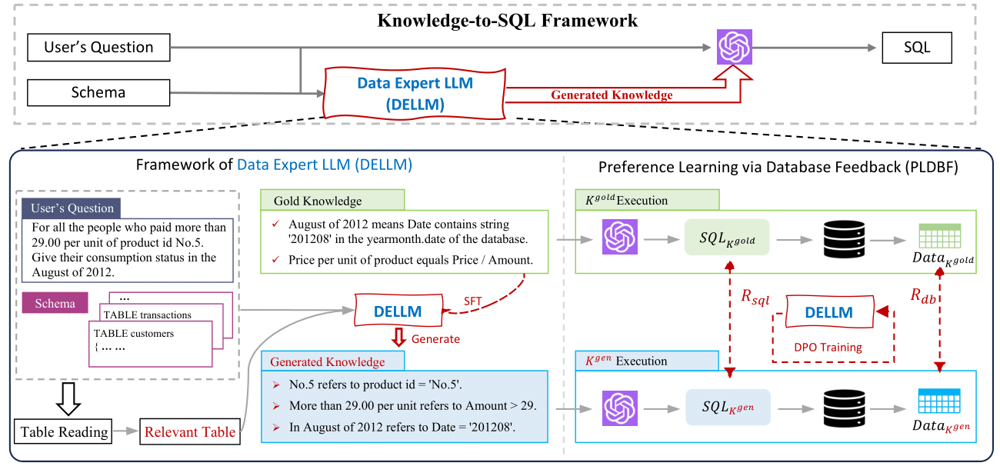

# Knowledge-to-SQL
**[2024/10] Check our video presentation in [Underline](https://underline.io/events/466/posters/18354/poster/102023-knowledge-to-sql-enhancing-sql-generation-with-data-expert-llm)!**

**[2024/08] The video presentation of our paper will be available soon.**

**[2024/08] The presentation of our paper are scheduled at Virtual Poster Session 2, check the poster and slides [here](./slides).**

**[2024/05] Our paper is accepted as a findings paper in ACL2024!**

We propose a novel framework **Knowledge-to-SQL** that leverages **Data Expert Large Language Model (DELLM)** to enhance SQL generation, the paper is available [here]().



## Setup

### Environment

**The GPU resources we use in our study is 4*A800-SXM4-80G with the corresponding CUDA version 12.1,** we strongly recommend using the torch version above 2.0.

```shell
# Clone the repository
git https://github.com/Rcrossmeister/Knowledge-to-SQL.git
cd ./Knowledge-to-SQL

# Create the conda environment
conda create -n dellm python=3.11.3
conda activate dellm

# Install the required packages
pip install -r requirements.txt
```

### Dataset

We mainly focus on **[BIRD](https://bird-bench.github.io/)** dataset in our study, we also support **[Spider](https://yale-lily.github.io/spider)** dataset for robustness study.

## Training

The training implementaion was inspired by **[LLaMA Factory](https://github.com/hiyouga/LLaMA-Factory)**, you can check their technical report [here](https://arxiv.org/abs/2403.13372). 

### Quick Start

We provide a script to quick start upon BIRD dataset

## Citation

Please cite our paper if you include Knowledge-to-SQL in your work:

```
@inproceedings{hong2024knowledge,
    title = "Knowledge-to-{SQL}: Enhancing {SQL} Generation with Data Expert {LLM}",
    author = "Hong, Zijin  and
      Yuan, Zheng  and
      Chen, Hao  and
      Zhang, Qinggang  and
      Huang, Feiran  and
      Huang, Xiao",
    booktitle = "Findings of the Association for Computational Linguistics ACL 2024",
    year = "2024"
}
```
